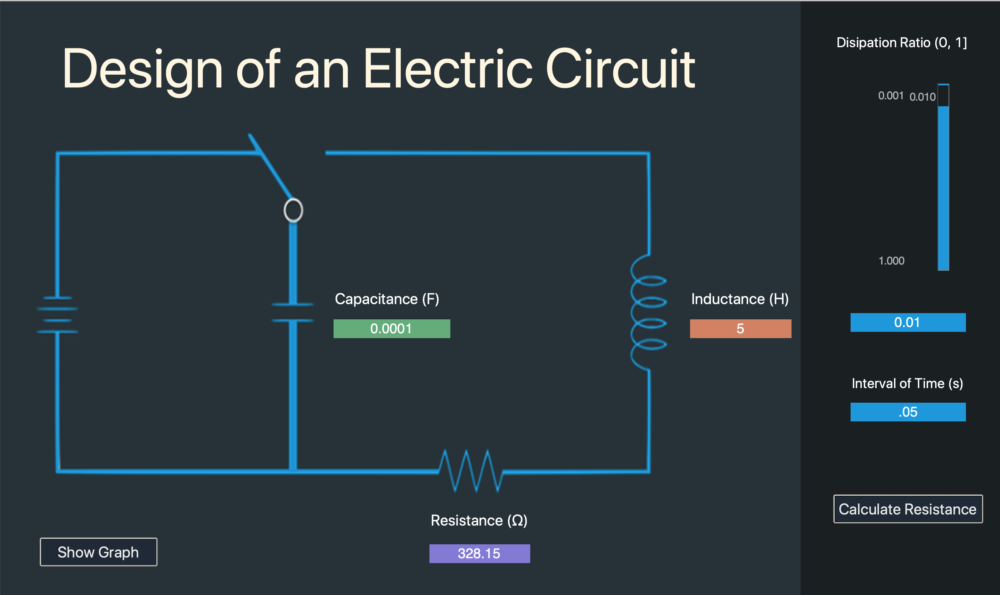
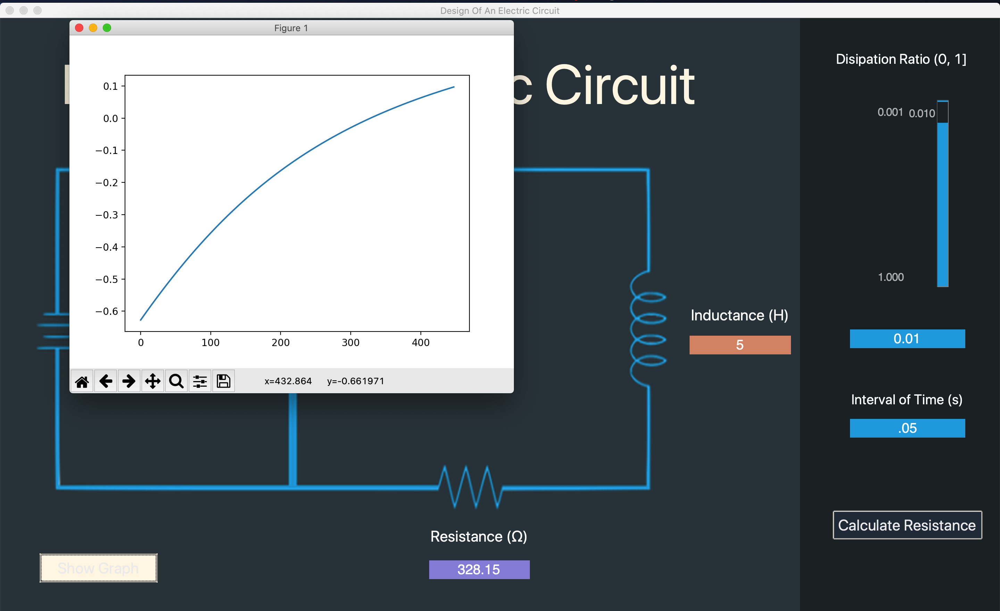
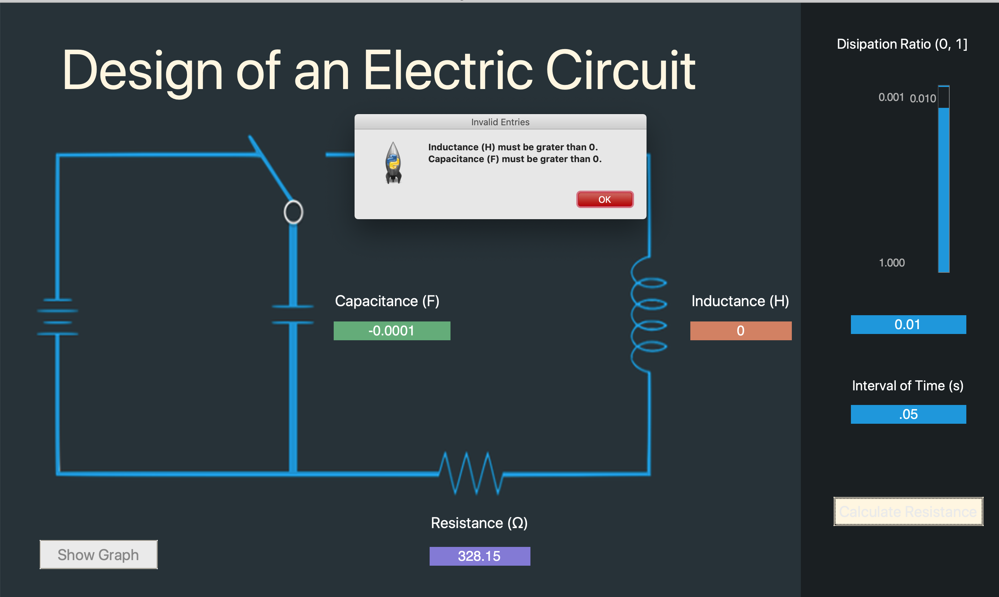

# DesignOfAnElectricCircuit

---

## Requierements

* Python v3.7.x (at least)

## Install requiered libraries

* `pip install -r requirements.txt`

## Run

* `python3 main.py` or `python main.py`

---

## Demo

* Dashboard

    

 

* Graph

    

 

* Validation of entry float range

    

 

* Validation of input data type

    

---
